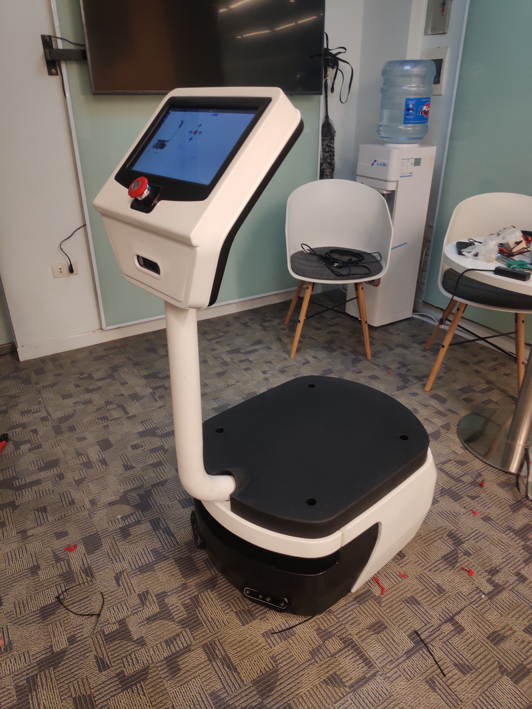

# JunBot Core

A Simple ROS package for JunBot. This package is used for collecting data and mapping enviroment.

Main features:

- [x] Mapping with T265 and 2D Lidar (Sick Tim751)
- [x] Navigation 
- [x] Relocalization (Using T265 and AMCL/Odometry fusion/junbot_relocalization)
- [x] Planner's costmap_2d parameter custom (Using junbot_planner/planner_reconfigure)
- [x] User interface (Using junbot_gui and junbot_mobile_app)
- [x] Object mapping (Using junbot_object_mapping)
- [ ] SemanticMapping

# Overview

<table>
  <tr>
    <td> </td>
    <td>  </td>
   </tr> 
</table>

## Hardware
- Custom platform
- Sick Tim751
- Jetson AGX Orin (32GB RAM)
- Realsense T265
- Realsense D455 (x2)
- ZED 2 (Option for object mapping package) 
 
## Software
- Ubuntu 20.04
- Jetpack 5.1
- CUDA 11.4
- Realsense SDK (2.43.0)
- Realsense ROS (2.2.23)
- ROS Noetic
- OpenCV 4.5.0
- Qt 5

# Install 

Follow this [link](https://github.com/lacie-life/junbot_core/blob/main/docs/install.md)

# Usage

```
# Build map
roslaunch junbot_slam junbot_slam.launch
roslaunch cartographer_junbot t265_camera.launch
roslaunch junbot_bringup sick_tim_781.launch

# Navigation 
roslaunch junbot_bringup junbot_core.launch
roslaunch junbot_navigation junbot_navigation.launch 

# User interface
rosrun junbot_gui junbot_gui

# Relocalization by using T265 and AMCL
rosrun amcl_relocalization amcl_relocalization 

# Planner's costmap_2d parameter custom 
rosrun planner_reconfigure planner_reconfigure_node
```

# Test

# Related Project

- [SemanticMapping](https://github.com/lacie-life/SemanticMapping)
- [junbot_relocalization](https://github.com/lacie-life/junbot_localization)
- [junbot_odometry_fusion](https://github.com/lacie-life/junbot_odometry_fusion)
- [junbot_mobile_app](https://github.com/lacie-life/junbot_app)


# Acknowledgement

- [Turtlebot3](https://github.com/ROBOTIS-GIT/turtlebot3)


 
 
 
